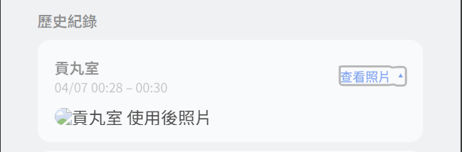

## Firestore and Firebase storage

### Q1：上傳到一半失敗會怎樣？

沒有原子化保護。 三個步驟是獨立的，中斷點不同有不同後果：

| 中斷點                              | 結果                            |
| ----------------------------------- | ------------------------------- |
| 壓縮失敗                            | 乾淨，什麼都沒寫                |
| Storage 上傳失敗（網路斷）          | 乾淨，Firestore 不會有 photoUrl |
| Storage 成功但 PATCH Firestore 失敗 | 孤兒檔案                        |

第三種情況是唯一真正有問題的 case：Storage 有圖片但 Firestore 沒有 | photoUrl，使用者看不到圖片但 Storage 佔空間。但發生機率不高（Storage 成功、網路又在此時斷），算是可接受的邊緣情況。

### Q2: Firestore Document ID

1. 面板檢視畫面的篩選功能是半閹割過的，真的要做資料篩選與查詢時，請去查詢建立工具中去完整的篩選。在那裏就可以用 id 直接抓出指定資料。啊草但這裡抓出來後似乎沒辦法做編輯。怎麼那麼搞剛。

2. 直接從網址連過去，https://console.firebase.google.com/u/0/project/tzai-space-pro/firestore/databases/-default-/data/~2Fbookings~2F{這裡填入指定資料夾的 document id}

### Q3: 現在的 firebase storage 是我可以隨便亂動刪除照片的嗎？

要是在 fierbase console 裡面隨便你刪，但是這會導致 firestore 裡面的 photoUrl 失效，導致圖片加載不出來，所以還是別從後端直接轟炸刪東西比較好。

如果真要刪的話，要同時先去 firestore 中找到指定的那筆資料，但這點就是個困難了，因為現在的 filter 一次只能篩一筆，並且這個 filter 無法處理任何時間資料，超爛，並且新版新增資訊內部 id 也是空的，需要更新讓 doc id 也被存進去才有辦法做搜尋。  
進一步，會希望管理員可以在日曆介面中把當前資料的 id 給複製出來。

進入當筆資料後，直接把 photoUrl 給刪掉，並且進去 storage 找到 id 的資料夾，接著就可以把裡面的照片刪除。

遇到極特殊情況，我也可以上去把 requirePhoto 欄位設定為 false 之類的

### Q4. Firestore SDK 即時監聽 realtime listener

https://firestore.googleapis.com/google.firestore.v1.Firestore/Listen/channel?gsessionid=47Ih28G3hVLDF5fAnx_oopNpBlAcIBlvJ7XicHhEpe_WQMrr0BzqXw&VER=8&database=projects%2Ftzai-space-pro%2Fdatabases%2F(default)&RID=rpc&SID=iYf7HGWppXOjAUhXKWkzNQ&AID=0&CI=0&TYPE=xmlhttp&zx=w4j2ps1lnx05&t=1

- Listen/channel — 長輪詢頻道，不是一般 REST 請求
- database=projects/tzai-space-pro/databases/(default) — 你的 DB
- SID、gsessionid — 這次連線的 session token，每次刷新都不同
- TYPE=xmlhttp — 用 XHR 做長連線，伺服器會持續推資料過來

實際要找某筆資料時，去 Firebase console → Firestore → bookings，點篩選：email == leosimba9487@gmail.com 找你的或 startTime 加日期範圍篩特定時段，比如直接篩選 2026 以後，會方便很多

### Q5. Firestore 的計費

按文件數量計費，不是按 query 次數。如果已經超出免費額度，帳單不會太貴（Firestore 讀取是 $0.06 / 10萬次），目前開發這幾天雖然 30 萬次但其實大概不到台幣 10 塊。

| 操作 | 計費單位             |
| ---- | -------------------- |
| 讀取 | 每個文件 1 次 read   |
| 寫入 | 每個文件 1 次 write  |
| 刪除 | 每個文件 1 次 delete |

免費額度：每天 50,000 reads / 20,000 writes / 20,000 deletes
