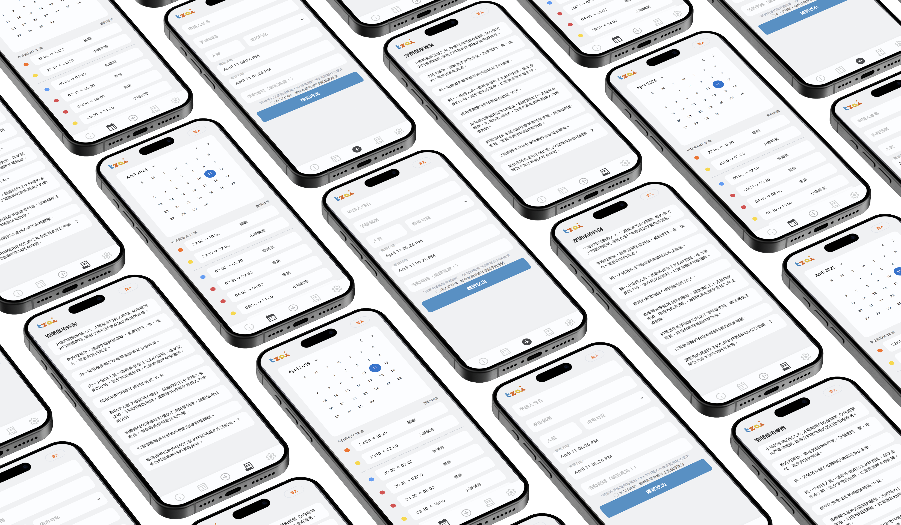
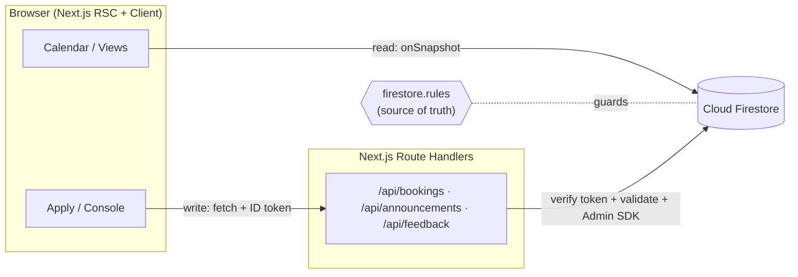

# tzai-space

> A production space-reservation platform for the shared social spaces of NTHU's Ren-Zhai (仁齋) dormitory — rebuilt from the ground up on Next.js 15 and a real-time Firestore backend.

[](https://github.com/LeoHsxg/tzai-space-pro/actions/workflows/ci.yml)


**🔗 Live site:** _replace with the current App Hosting domain_ · **📄 Design docs:** [Re-Design deck](project-docs/仁齋空間借用系統%20Re-Design.pdf)

tzai-space lets dormitory residents browse room availability on a shared calendar, reserve one of five social spaces under fair-use rules, and manage their own bookings — while giving administrators a console for announcements and moderation. It is a **live production system serving real residents**, and this repository is its second architecture generation: a full re-platforming of the original React/Vite + Google Calendar app onto server-rendered Next.js with Firestore as the single source of truth.

<p align="center">
  
</p>

## Table of Contents

- [Features](#features)
- [Tech Stack](#tech-stack)
- [Architecture](#architecture)
- [Project Structure](#project-structure)
- [Getting Started](#getting-started)
- [Environment Variables](#environment-variables)
- [Scripts](#scripts)
- [Testing](#testing)
- [Deployment](#deployment)
- [Background & Design](#background--design)
- [License](#license)

## Features

### For residents
- **Real-time booking calendar** — availability updates live via Firestore `onSnapshot`; new reservations appear instantly without a refresh, and colour-coded rooms make conflicts obvious at a glance.
- **Guided application flow** — a consent-gated form with client- and server-side validation (phone/party-size format, a 31-day booking horizon, a 4-hour maximum, and start/end sanity checks) plus conflict detection to prevent double bookings.
- **Personal booking management** — view upcoming and historical bookings and cancel your own reservations directly, no admin required.
- **Announcements & notifications** — a server-rendered banner and a notification bell surface system announcements (Markdown-rendered), with a per-user "seen" state so nothing important is missed.
- **Storeroom** (`/storeroom`) — a lightweight extras page with a lunch/dinner randomizer and a **suggestion box** that routes feedback straight to the team.
- **Responsive by design** — a mobile-first experience plus a dedicated desktop layout (persistent sidebar, two-column month calendar, centered dialogs).

### For administrators
- **Admin console** (`/console`) — publish announcements and moderate bookings.
- **Role-based access** — administrators are defined by an allowlist in Firestore; privileged actions (e.g. cancelling any booking, publishing announcements) are enforced on the server.

### Engineering highlights
- **Server-authoritative writes** — all mutations go through Next.js Route Handlers backed by the Firebase Admin SDK; the client only ever reads, guarded by Firestore Security Rules.
- **Security rules as the source of truth** — permissions live in `firestore.rules` and are covered by an integration test suite.
- **Automated quality gate** — unit tests, Firestore-rules tests, lint, type-check, and build all run in CI on every push and pull request.

## Tech Stack

| Layer | Technology |
| --- | --- |
| Framework | **Next.js 15** (App Router, React Server Components + SSR) |
| Language | **TypeScript** |
| UI | **shadcn/ui** + Base UI/Radix primitives, **Tailwind CSS**, `lucide-react`, `sonner` (toasts) |
| Calendar | `react-day-picker` (custom calendar) + `@mui/x-date-pickers` (time selection) |
| Data | **Cloud Firestore** (real-time listeners) |
| Server | Next.js Route Handlers + **Firebase Admin SDK** |
| Auth | **Firebase Authentication** (ID-token verified server-side) |
| Content | `marked` + `@tailwindcss/typography` (Markdown announcements & rules) |
| Testing | **Vitest**, `@firebase/rules-unit-testing` |
| CI/CD | **GitHub Actions** → **Firebase App Hosting** |
| Analytics | Google Analytics, Microsoft Clarity |

## Architecture

The core principle is a **strict read/write split**: browsers read Firestore directly (fast, real-time, and scoped by Security Rules), while every write is funnelled through server-side API routes that authenticate the caller, validate input, and use the Admin SDK to bypass rules deliberately and safely.



### Firestore collections

| Collection | Purpose | Client access |
| --- | --- | --- |
| `bookings` | Reservation records — the source of truth | Read-only |
| `regulations/current` | The current borrowing rules (Markdown) | Read-only |
| `announcements` | System announcements | Read-only |
| `admins/{email}` | Admin allowlist — a document's existence grants admin | Read-only |
| `feedback` | Suggestion-box submissions | No direct read/write (server-only) |

### API routes

| Route | Method | Purpose |
| --- | --- | --- |
| `/api/bookings` | `POST` | Create a booking (validation + conflict detection) |
| `/api/bookings/[id]` | `DELETE` | Cancel a booking (soft delete) |
| `/api/announcements` | `GET` / `POST` | Read latest / publish (admin only) |
| `/api/feedback` | `POST` | Submit feedback to the suggestion box |

All mutating routes require an `Authorization: Bearer <Firebase ID token>` header, verified server-side with the Admin SDK before any Firestore access.

## Project Structure

```
src/
├── app/                  # Next.js App Router: routes + API route handlers
│   ├── api/              # Server-authoritative endpoints (Firebase Admin SDK)
│   │   ├── bookings/     #   POST /  + DELETE /[id]
│   │   ├── announcements/#   GET / POST
│   │   └── feedback/     #   POST
│   ├── apply/  console/  profile/  rule/  storeroom/   # pages
│   └── layout.tsx  page.tsx  robots.ts
├── views/                # Page-level view components (Calendar, ApplyForm, ...)
├── Components/           # Shared UI — desktop/ (responsive layout) + ui/ (shadcn primitives)
├── context/              # React contexts: Auth, Bookings, UI, ApplyDialog
├── firebase/             # Client SDK (firebase.ts) + Admin SDK (admin.ts)
├── func/                 # Pure domain logic + colocated unit tests
├── hooks/                # useAuth, useIsAdmin
├── lib/                  # isAdmin, utils (cn)
└── types/                # Booking, Announcement type definitions
firestore.rules           # Security rules — single source of truth for permissions
firestore.indexes.json    # Composite indexes
tests/rules/              # Firestore Security Rules integration tests
```

## Getting Started

### Prerequisites
- **Node.js 22+** and npm
- **Java 21+** — only required to run the Firestore rules tests (`npm run test:rules`), which spin up the emulator
- **Firebase CLI** (`npm install -g firebase-tools`) — for the emulators and deploys

### Install

```bash
git clone https://github.com/LeoHsxg/tzai-space-pro.git
cd tzai-space-pro
npm install
```

### Configure environment

Create a `.env.local` in the project root (see [Environment Variables](#environment-variables)). At minimum you need `NEXT_PUBLIC_API_KEY`; to exercise the API routes locally you also need the three `FIREBASE_ADMIN_*` service-account values.

### Run

```bash
npm run dev            # http://localhost:3000
```

Optionally, run the Firebase emulators (Firestore :8080, Hosting :5000, Database :9000):

```bash
firebase emulators:start
```

## Environment Variables

| Variable | Scope | Required | Description |
| --- | --- | --- | --- |
| `NEXT_PUBLIC_API_KEY` | Client | Yes | Firebase Web API key |
| `FIREBASE_ADMIN_PROJECT_ID` | Server | Local only | Admin SDK project ID |
| `FIREBASE_ADMIN_CLIENT_EMAIL` | Server | Local only | Service-account client email |
| `FIREBASE_ADMIN_PRIVATE_KEY` | Server | Local only | Service-account private key |

> On **Firebase App Hosting**, the server uses Application Default Credentials (ADC), so the three `FIREBASE_ADMIN_*` variables are only needed for local development. Never commit `.env.local` or paste secrets into issues/PRs.

## Scripts

| Command | Description |
| --- | --- |
| `npm run dev` | Start the dev server on `localhost:3000` |
| `npm run build` | Production build |
| `npm run start` | Serve the production build |
| `npm run lint` | ESLint |
| `npm test` | Vitest unit tests |
| `npm run test:rules` | Firestore Security Rules tests (auto-starts the emulator; needs Java 21+) |
| `npx tsc --noEmit` | Type-check |

## Testing

- **Unit tests (Vitest)** cover the pure domain logic — booking validation (`func/applyFunc.ts`) and booking-status helpers (`func/bookingUtils.ts`).
- **Firestore Security Rules tests** (`tests/rules/`) run against the emulator via `@firebase/rules-unit-testing` to assert that clients can only read what they should and can never write directly.
- **CI** (`.github/workflows/ci.yml`) runs the full gate on every push/PR to `main`: `lint → typecheck → unit tests → rules tests → build`.

```bash
npm run lint && npx tsc --noEmit && npm test    # fast local check
npm run test:rules                              # rules (requires Java 21+)
```

## Deployment

Production runs on **Firebase App Hosting** (`apphosting.yaml`); server components and API routes execute in a managed Node environment using ADC for Admin SDK access. Deploys are driven from the `main` branch.

> **Note:** the classic `hosting` block in `firebase.json` (`public: dist`) is a leftover from the Vite era and is **not** used by the App Hosting deployment. Treat `firebase deploy --only hosting` as unsupported for this project.

## Background & Design

tzai-space replaces a long-unmaintained legacy reservation tool that had poor readability, a deep and error-prone flow, and no real enforcement of usage limits. The redesign targets three areas — **visual clarity**, **intuitive interaction**, and **enforceable management rules** — and this repository takes that further with a complete re-architecture (Next.js SSR, Firestore real-time data, a server-side write layer, security rules, tests, and CI).

Design and planning material lives in [`project-docs/`](project-docs/) and [`docs/`](docs/) (data-architecture review, desktop redesign spec, notification and storeroom plans, and more).

## License

No license has been assigned yet; all rights reserved. If you intend to reuse or contribute, please open an issue to discuss.
